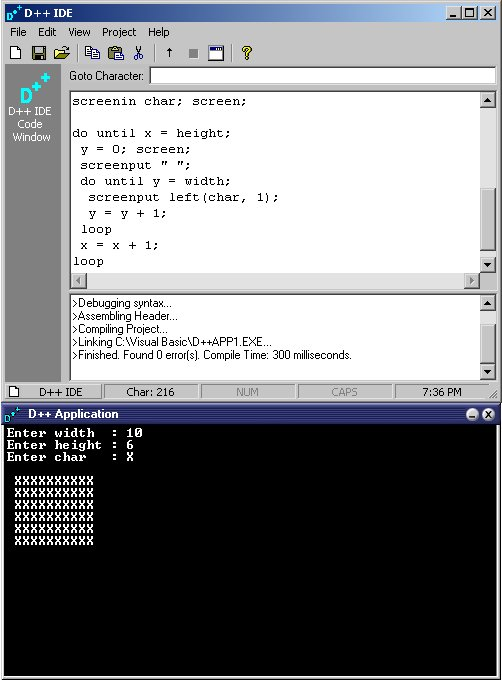



## D\+\+ IDE 2\.5 \- includes syntax checking\! \(update\)

### Description

----

UPDATE 

----

NEW - expressions are better then ever in D++. It can handle all kinds of them, and prevents bad commands. You have to see it!

NEW - FOR loops added, and are much faster then DO WHILE or DO UNTIL loops.

D++ is faster then ever! Less then 1ms for a series of 10 commands...

----

FIXED 

----

There were some bugs of the previous version of D++, where in loops and if's, they would look IN quotes, which can be very bad.

If you downloaded before August 11, please download it again for the full version. I also added it so you can define variables as they are declared, and a simpler syntax for adding 1 to a variable or suptracting 1

from a variable

D++ is a scripting language that can handle things like basic I/O, variables, expression evaluation, full if statements, nested loops, functions, and much more! It has a syntax checker which will check your syntax before you run your aplication and tell you of any errors it finds. You can download the latest files using the IDE, and a full help file with new code examples are included. It can compile your application into an EXE, using it's own console or compile to DOS. It now handles if statements better, as beore it did not find the proper endif or else, and can do nested loops (as displayed in screenshot). Full source to the DLL and the IDE are included. Please vote and leave comments so I can improve D++! ***This is new, as there are many different things, different from previous D++ compilers***
 
### More Info
 
D++ Source Code

Required controls:

Microsoft Windows Common Controls 6.0

Microsoft Internet Transfer Control

Microsoft Common Dialog Control

Output based on language results

None that I know of.

             |
---                |---
**Submitted On**   |2001-08-26 17:12:56
**By**             |[Daniel Smith \(SqueakMac\)](https://github.com/Planet-Source-Code/PSCIndex/blob/master/ByAuthor/daniel-smith-squeakmac.md)
**Level**          |Advanced
**User Rating**    |3.7 (107 globes from 29 users)
**Compatibility**  |VB 5\.0, VB 6\.0
**Category**       |[Complete Applications](https://github.com/Planet-Source-Code/PSCIndex/blob/master/ByCategory/complete-applications__1-27.md)
**World**          |[Visual Basic](https://github.com/Planet-Source-Code/PSCIndex/blob/master/ByWorld/visual-basic.md)
**Archive File**   |[D\+\+ IDE 2\_253858262001\.zip](https://github.com/Planet-Source-Code/daniel-smith-squeakmac-d-ide-2-5-includes-syntax-checking-update__1-25883/archive/master.zip)

